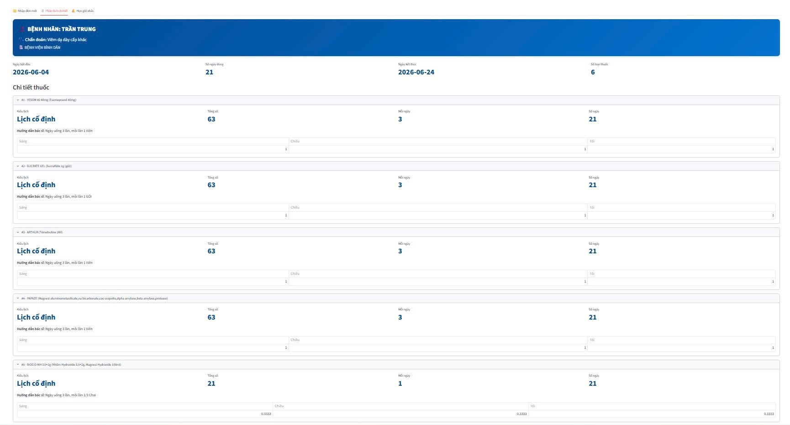
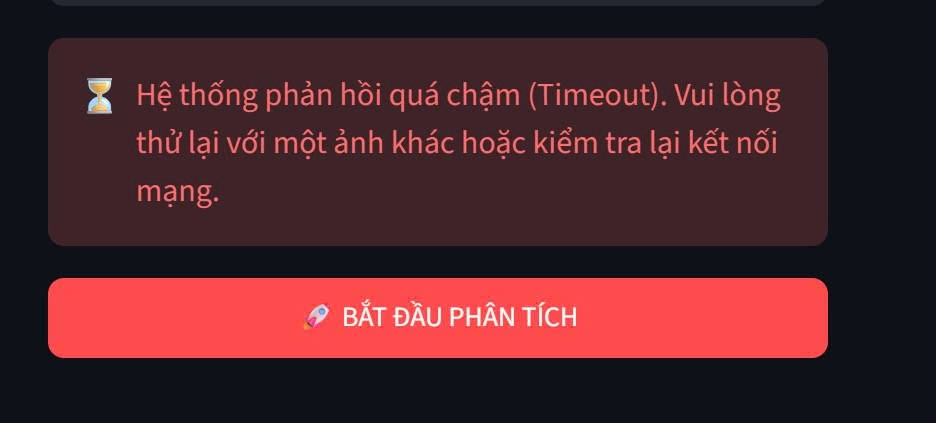
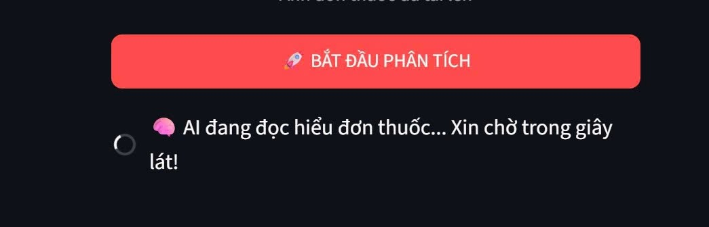

# SPEC Sản Phẩm: Tính năng Nhắc dùng thuốc (App Nhà thuốc Long Châu)

## 1. Bằng chứng

**Nỗi đau của người dùng:**
- **Trải nghiệm trực tiếp:** Khi nhận đơn thuốc từ bệnh viện hoặc mua thuốc tại nhà thuốc, người dùng thường phải tự nhớ lịch uống thuốc hoặc tự cài báo thức bằng tay. Việc nhập liệu thủ công từng loại thuốc, số lượng, và giờ uống (sáng/trưa/chiều/tối) rất mất thời gian và dễ dẫn đến sai sót hoặc lười biếng bỏ dở.
- **Quan sát bên ngoài:** Khách hàng người cao tuổi thường xuyên quên uống thuốc hoặc nhầm lẫn liều lượng (như chia liều, uống khi cần) do các đơn thuốc ghi chú phức tạp. Các ứng dụng nhắc thuốc hiện tại trên thị trường thường bắt người dùng nhập tay toàn bộ thông tin từ đầu, tạo rào cản lớn khi bắt đầu sử dụng.

## 2. Lát cắt để build

**Một người dùng (bệnh nhân/người nhà)** chụp ảnh đơn thuốc, **AI tự động trích xuất thông tin (OCR)** và **gợi ý lịch uống thuốc chi tiết**, sau đó người dùng kiểm tra lại và **lưu lịch nhắc nhở thẳng vào Calendar của điện thoại** một cách nhanh chóng.

## 3. AI Product Canvas

| Ô | Trả lời |
|---|---------|
| **Value (Giá trị)** | Giúp người bệnh (đặc biệt khách hàng của Long Châu) tiết kiệm thời gian tạo lịch nhắc uống thuốc, giảm thiểu việc quên thuốc hoặc uống sai liều. AI giải quyết khâu nhập liệu thủ công nhàm chán và phức tạp. |
| **Trust (Niềm tin)** | AI chỉ đóng vai trò "người nhập liệu hộ". Toàn bộ thông tin AI đọc được sẽ hiển thị rõ ràng trên UI màn hình "Tạo đơn" để người dùng đối chiếu với ảnh gốc và tự do chỉnh sửa trước khi xuất lịch hẹn. |
| **Feasibility (Tính khả thi)** | Rất khả thi. Sử dụng Google Gemini 2.5 Flash xử lý OCR cực kỳ nhanh và xuất dữ liệu định dạng JSON có cấu trúc rất tốt. Việc tạo file `.ics` cũng đơn giản và được hỗ trợ native trên iOS/Android. |
| **Tín hiệu học** | Bất cứ khi nào người dùng chỉnh sửa (sửa tên thuốc, liều lượng) thay vì chấp nhận kết quả OCR mặc định, dữ liệu đó có thể được lưu lại (feedback loop) để đánh giá độ chính xác của model và cải thiện prompt. |

## 4. Tăng năng lực hay tự động hóa

**Quyết định: Tăng năng lực (Augment).**
- **Lý do:** Y tế là lĩnh vực nhạy cảm, việc tự động hóa (automate) tạo báo thức mà không có sự kiểm duyệt của con người có thể gây hậu quả nghiêm trọng nếu AI đọc sai liều (ví dụ 1/2 viên thành 12 viên).
- **Phạm vi của AI:** AI chỉ "gợi ý và chuẩn bị" form dữ liệu. Con người luôn giữ quyền quyết định ở bước kiểm tra bảng nhắc và bấm nút "Lưu giờ nhắc".

## 5. Bốn đường đi của trải nghiệm

| Đường đi | Xử lý |
|----------|-------|
| **Đường thuận** | AI đọc chính xác 100% đơn thuốc rõ ràng -> UI hiển thị chuẩn các slot Sáng/Trưa/Chiều/Tối -> Người dùng chỉ việc kiểm tra và bấm "Lưu giờ nhắc". |
| **Khi AI không chắc** | Gặp thuốc có ghi chú đặc biệt ("uống khi sốt", "chia 2 lần") -> AI phân loại vào nhóm `as_needed` (khi cần) hoặc `divided_dose` và hiện cảnh báo để người dùng chú ý tinh chỉnh thêm. |
| **Khi AI sai** | AI nhận diện sai chữ viết tay -> Người dùng trực tiếp ấn vào ô dữ liệu trên giao diện màn "Tạo đơn" để gõ lại cho đúng. |
| **Khi người dùng sửa** | Dữ liệu người dùng sửa khác với file raw JSON ban đầu -> Log lại sự kiện này trên backend để tracking tỷ lệ lỗi của OCR, làm cơ sở cải thiện trong tương lai. |

## 6. Những kiểu lỗi đáng lo nhất

1. **Sai liều lượng nghiêm trọng:** 
   - *Khi nào:* AI nhầm lẫn các ký tự số (ví dụ 1/4 thành 14) do chữ viết tay bác sĩ xấu hoặc bị mờ.
   - *Hậu quả:* Người bệnh có thể uống quá liều gây ngộ độc.
   - *Xử lý (Prototype):* Backend có logic chuẩn hóa `PrescriptionNormalizer` để xử lý phân số. Giao diện luôn bắt buộc người dùng xem lại bảng tóm tắt lịch uống và có thể đưa ra cảnh báo nếu liều lượng một lần uống bất thường.
2. **Nhận diện sai loại lịch uống (Schedule Mode):** 
   - *Khi nào:* Lời dặn "Uống cách ngày" nhưng AI lại cho vào lịch uống hàng ngày.
   - *Hậu quả:* Uống sai phác đồ điều trị.
   - *Xử lý:* Cung cấp tùy chọn cho phép người dùng tự đổi loại lịch (Cố định, Khi cần, v.v.).

## 7. Kế hoạch kiểm thử và bằng chứng demo

### 7.1. Mục tiêu
 
**Mục tiêu:**
Xác minh tính năng Auto-fill từ ảnh đơn thuốc hoạt động chính xác, giảm thiểu số lượt chạm của người dùng và lập lịch nhắc nhở uống thuốc.
 
**Tiêu chí thành công:**
Hệ thống hiển thị đúng luồng giao diện, đổ dữ liệu chuẩn xác lên form, không bị văng (crash) khi gặp ảnh lỗi, và vận hành trơn tru cơ chế Human-in-the-loop.
 
---
 
### 7.2. Phạm vi Kiểm thử (In-Scope & Out-of-Scope)
 
**✅ In-Scope (Sẽ test):**
- Luồng upload ảnh
- UI loading
- Form giao diện bóc tách dữ liệu (Tên, Dạng, Liều)
- Chức năng chỉnh sửa thủ công (Edit)
- Chức năng nhắc nhở lịch thuốc uống
**❌ Out-of-Scope (Không test):**
- Tính năng quét mã vạch hộp thuốc
- Cảnh báo tương tác thuốc
- Chia sẻ lịch nhắc thuốc cho thiết bị của người thân
> Các hạng mục Out-of-Scope đã được chuyển vào Backlog.
 
---
 
### 7.3. Môi trường & Công cụ test
 
Tập trung vào **Black Box** và **Grey Box**, quá trình kiểm thử sẽ thực hiện trực tiếp trên giao diện và luồng mạng cơ bản thay vì can thiệp vào mã nguồn.
 
#### Môi trường
- Trình duyệt chạy trên localhost
- Môi trường mạng thay đổi (Wifi ổn định vs. 4G yếu) để test trạng thái Loading
#### Tools
- **Thiết bị** để test tính năng mở Camera chụp ảnh
- **Bộ dữ liệu Test (Dataset):** Các file ảnh đơn thuốc thực tế bao gồm:
  - Ảnh rõ nét in máy
  - Ảnh thiếu sáng
  - Ảnh chữ bác sĩ viết tay cực ngoáy
---
 
### 7.4. Chiến lược Kiểm thử (Test Strategy)
 
Chiến lược kiểm thử sẽ không đi sâu vào code (White Box) mà tập trung vào việc đánh giá trải nghiệm đầu ra và kiểm soát rủi ro luồng AI.
 
#### Kiểm thử Hộp đen (Black Box Testing — Đánh giá UX/UI)
 
Đóng vai trò là một người bệnh nhân sử dụng app. Chỉ tương tác qua giao diện (bấm nút, upload ảnh, xem màn hình form).
 
**Mục đích:**
Xác minh hệ thống có thực sự giải quyết được bài toán giảm số lượt chạm (clicks) từ **15–20 xuống còn 1–2 click** hay không. Đảm bảo form hiển thị đầy đủ và nút bấm hoạt động bình thường.
 
#### Kiểm thử Hộp xám (Grey Box Testing — Đánh giá Logic AI & Rủi ro)
 
Sử dụng sự hiểu biết về thiết kế hệ thống (VD: biết rằng Prompt đã thiết lập AI phải trả về `null` nếu chữ quá xấu) kết hợp với thao tác người dùng.
 
**Mục đích:**
Cố tình tiêm các "dữ liệu độc" (ảnh mờ, ảnh chụp sai chủ thể) để ép AI rơi vào rủi ro. Qua đó, quan sát xem:
- Giao diện có bắt được tín hiệu `null` từ Backend để hiển thị **cảnh báo đỏ** và để trống form (chuyển giao quyền cho người dùng) hay không
- App có tự động đoán mò sai liều lượng thuốc hay không
---
 
### 7.5. Danh sách Kịch bản Kiểm thử chi tiết (Test Cases)

#### TC01 — Auto-fill với ảnh đơn thuốc in máy rõ nét (Happy Path)

| Field | Detail |
|-------|--------|
| **ID** | TC01 |
| **Description** | Test tính năng Auto-fill với ảnh đơn thuốc in máy rõ nét (Happy Path) |
| **Procedure** | 1. Bấm "Chụp ảnh/Tải ảnh" <br> 2. Upload ảnh đơn thuốc in máy rõ nét (1 loại thuốc) <br> 3. Chờ màn hình loading kết thúc |
| **Expected Result** | Form hiển thị tự động điền đúng 100% Tên thuốc, Dạng thuốc và Liều lượng tương ứng |
| **Test Result** | Pass |

---

#### TC02 — Bóc tách dữ liệu từng mặt hàng riêng lẻ (Multiple Products)

| Field | Detail |
|-------|--------|
| **ID** | TC02 |
| **Description** | Test bóc tách dữ liệu cho từng mặt hàng riêng lẻ (Multiple Products) |
| **Procedure** | 1. Upload ảnh đơn thuốc chứa nhiều loại thuốc khác nhau <br> 2. Quan sát giao diện form sau khi AI xử lý |
| **Expected Result** | Hệ thống bóc tách cấu trúc liều dùng cho các sản phẩm riêng lẻ trên từng dòng tương ứng, không gộp chung thành một tóm tắt tổng thể ở cấp độ đơn thuốc |
| **Test Result** | Pass |

**📸 Evidence:**


> _(Chụp màn hình hiển thị từng dòng thuốc được bóc tách riêng lẻ)_

---

#### TC03 — Xử lý chữ viết tay không thể đọc được

| Field | Detail |
|-------|--------|
| **ID** | TC03 |
| **Description** | Test khả năng xử lý rủi ro khi chữ bác sĩ viết tay không thể đọc được |
| **Procedure** | 1. Upload ảnh đơn thuốc viết tay cực kỳ ngoáy/mờ <br> 2. Kiểm tra các trường dữ liệu trên UI |
| **Expected Result** | AI không đoán mò. Các trường không đọc được (như Liều lượng) phải để trống (hiển thị `null` từ backend) và hiện cảnh báo màu đỏ yêu cầu nhập tay |
| **Test Result** | Fail |

**📸 Evidence:**


> _(Chụp màn hình thể hiện trường để trống và cảnh báo màu đỏ)_

---

#### TC04 — Tải lên hình ảnh không phải đơn thuốc

| Field | Detail |
|-------|--------|
| **ID** | TC04 |
| **Description** | Test việc tải lên hình ảnh không chứa văn bản / không phải đơn thuốc |
| **Procedure** | 1. Bấm "Tải ảnh" <br> 2. Chọn một bức ảnh phong cảnh hoặc selfie <br> 3. Chờ API xử lý |
| **Expected Result** | Hệ thống hiển thị Popup báo lỗi: _"Không tìm thấy thông tin đơn thuốc hợp lệ. Vui lòng thử lại"_ và không crash app |
| **Test Result** | Pass |

**📸 Evidence:**


> _(Chụp màn hình hiển thị popup báo lỗi)_

---

#### TC05 — Trạng thái Loading (Perception)

| Field | Detail |
|-------|--------|
| **ID** | TC05 |
| **Description** | Test trạng thái Loading (Perception) để giữ chân người dùng |
| **Procedure** | 1. Upload ảnh đơn thuốc có dung lượng lớn (khoảng 5MB) <br> 2. Quan sát giao diện trong lúc chờ API LLM phản hồi |
| **Expected Result** | Màn hình không bị đóng băng. Hiển thị vòng xoay loading cùng dòng chữ _"AI đang đọc tên thuốc và liều dùng..."_ |
| **Test Result** | Pass |

**📸 Evidence:**


> _(Chụp màn hình trạng thái loading đang hiển thị)_

---

#### TC6 — Tính toàn vẹn cấu trúc JSON trả về (White-box/Backend)

| Field | Detail |
|-------|--------|
| **ID** | TC6 |
| **Description** | Test tính toàn vẹn cấu trúc JSON trả về |
| **Procedure** | 1. Gửi request chứa ảnh qua API endpoint <br> 2. Chạy kịch bản autograding tests kiểm tra response |
| **Expected Result** | Chuỗi JSON trả về hợp lệ, parse thành công và chứa đầy đủ các keys bắt buộc |
| **Test Result** | Pass |

**📸 Evidence:**

> _(Log/response JSON từ API trả về khi chạy autograding tests)_

```json
{
  "start_date": "2026-06-04",
  "raw_json": {
    "data": {
      "hospital_name": "Sở Y tế Thành phố Đà Nẵng",
      "patient_name": "HIDDEN",
      "patient_gender": "Nam",
      "diagnose": "Thấp không ảnh hưởng đến tim",
      "table_information": [
        {
          "no": 1,
          "medicine_name": "Penicilin(duo dạng Phenoxymethylpenicilin Kali) 400.000 UI",
          "medicine_count": "30 Viên",
          "medicine_guide": {
            "summary": "Uống: Sáng 2 Viên, Trưa 2 Viên, Chiều 2 Viên",
            "use": "Uống",
            "type": "Viên",
            "guide_morning": "2 Viên",
            "guide_noon": "2 Viên",
            "guide_afternoon": "2 Viên",
            "guide_evening": ""
          }
        },
        {
          "no": 2,
          "medicine_name": "Paracetamol (acetaminophen) 500mg (Mypara 500)",
          "medicine_count": "10 Viên",
          "medicine_guide": {
            "summary": "Uống: Sáng 1 Viên, Chiều 1 Viên",
            "use": "Uống",
            "type": "Viên",
            "guide_morning": "1 Viên",
            "guide_noon": "",
            "guide_afternoon": "1 Viên",
            "guide_evening": ""
          }
        }
      ]
    }
  }
}

```
---

### 7.6. Scenerio Test

#### Kịch bản 1: Trải nghiệm Lý tưởng (The Happy Path — Đơn thuốc tiêu chuẩn)

| Field | Detail |
|-------|--------|
| **Mục tiêu** | Xác minh luồng cốt lõi của hệ thống hoạt động hoàn hảo trong điều kiện dữ liệu đầu vào lý tưởng, đạt được mục tiêu giảm thiểu tối đa số lượt chạm (clicks) của người dùng |
| **Bối cảnh** | Bệnh nhân chụp một tờ đơn thuốc in máy tính rõ ràng, đủ Tên thuốc, Dạng thuốc và Liều dùng (Sáng/Trưa/Tối) |
| **Test Result** | ✅ PASS |

**Các bước thực hiện:**

1. Người dùng bấm "Chụp ảnh đơn thuốc" và tải ảnh chuẩn lên
2. Màn hình Loading hiển thị thông điệp _"AI đang đọc đơn thuốc..."_ trong 3–5 giây
3. Giao diện form xuất hiện, tự động điền sẵn 100% dữ liệu vào các ô tương ứng
4. Người dùng bấm "Xác nhận & Lưu lịch nhắc"

**Kết quả mong đợi (Expected Result):**
Báo thức được thiết lập thành công vào hệ thống. Số thao tác (click) từ lúc bóc tách đến lúc lưu chỉ mất **1–2 lần chạm**.

---

#### Kịch bản 2: Trải nghiệm Chỉnh sửa thủ công (Human-in-the-loop cơ bản)

| Field | Detail |
|-------|--------|
| **Mục tiêu** | Kiểm tra cơ chế "Xác nhận & Chỉnh sửa" (Auto-fill + Human review). Đảm bảo người dùng luôn có quyền kiểm soát cuối cùng và ghi đè được dữ liệu của AI |
| **Bối cảnh** | AI đọc đúng thông tin trên đơn (VD: Uống 2 viên), nhưng bác sĩ dặn miệng bệnh nhân là _"Hôm nay chỉ uống 1 viên thôi"_. Bệnh nhân muốn sửa lại số lượng trước khi lưu |
| **Test Result** | ✅ PASS |

**Các bước thực hiện:**

1. Người dùng tải ảnh đơn thuốc lên
2. Giao diện form xuất hiện với dữ liệu AI đã điền đúng (Số lượng: **2 viên**)
3. Người dùng bấm vào icon "Sửa" ở ô Số lượng, xóa số `2` và gõ số `1`
4. Người dùng bấm "Xác nhận & Lưu lịch nhắc"

**Kết quả mong đợi (Expected Result):**
Ứng dụng lưu lại giá trị mới do người dùng nhập (**1 viên**) và thiết lập báo thức theo giá trị này, không bị ghi đè lại bởi dữ liệu cũ của AI.

---

### 7.7. Kết luận

**Điểm sáng**: Luồng Auto-fill cơ bản hoạt động rất tốt. AI trích xuất và đổ dữ liệu JSON chính xác cho từng loại thuốc riêng biệt (TC01, TC02, TC04-TC06 PASS).

**Cần khắc phục**: Nhận diện đơn thuốc trước chữ viết tay mờ/ngoáy (TC03 FAIL) chưa thành công, cần cải thiện tiếp.


## 8. Phân công

1. Lê Quang Minh - 2A202600801         : Build BE
2. Nông Đức Hoàng - 2A202600580        : QA + Test
3. Nguyễn Đức Minh - 2A202600604       : Build FE
4. Lưu Xuân Thế - 2A202600983          : Build AI logic
5. Nguyễn Quang Anh - 2A202600608      : Report + Slide + fix UI
6. Lương Thị Hồng Nhung - 2A202600811  : Build BE